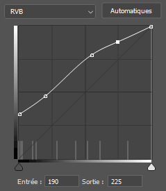

# color-curve-adjust

[](https://github.com/jzecca/color-curve-adjust/actions/workflows/ci.yaml)
[](https://codecov.io/gh/jzecca/color-curve-adjust)

> Performs a Photoshop/GIMP curve adjustment on a RGB color

Based on [CSPL.js](https://github.com/kuckir/CSPL.js).
Read more about the algorithm [here](http://blog.ivank.net/interpolation-with-cubic-splines.html).

## Install

```
$ npm install color-curve-adjust
```

## Usage

- Edit your curve in Photoshop

    

- Create an array of each point of the curve

    ```ts
    const curve = [
        { x: 0, y: 85 },
        { x: 50, y: 120 },
        { x: 140, y: 200 },
        { x: 190, y: 225 },
        { x: 255, y: 255 },
    ];
    ```

- Import the module and call it with a color and your array

    ```ts
    import curveAdjust from 'color-curve-adjust';

    curveAdjust('#5a2149', curve);
    //=> '#9d6b8d'

    curveAdjust('#5a2149', curve, 'r');   // adjust only the red channel
    //=> '#9d2149'
  
    curveAdjust('#5a2149', curve, 'gb');  // adjust only green & blue channels
    //=> '#5a6b8d'
    ```

## License

MIT © [Jérôme Zecca](https://zed-k.com)
